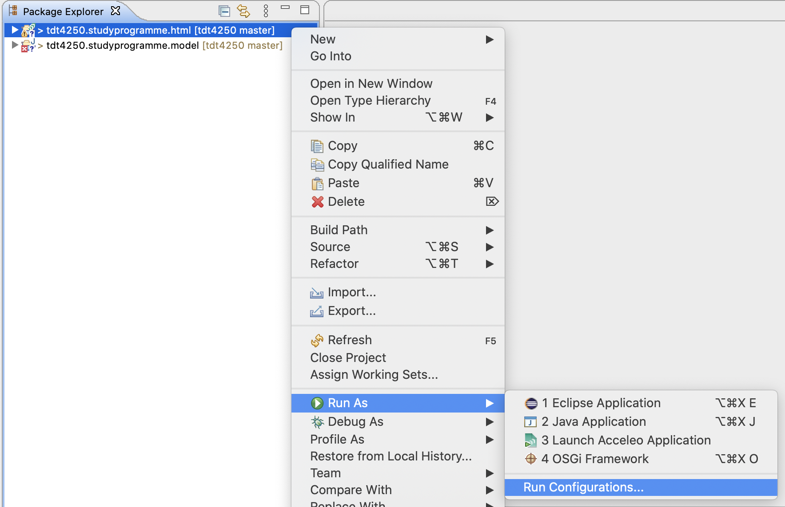
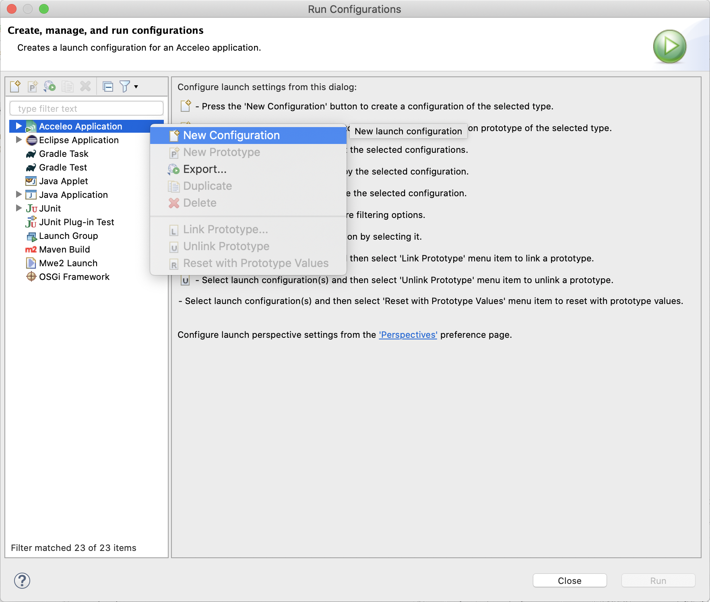
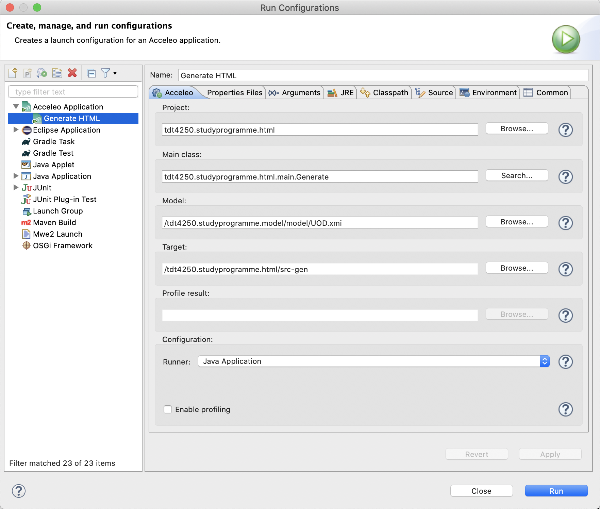

# M2T Transformation

This project uses an instance of the [studyprogramme model](../../assignment-1/tdt4250.studyprogramme.model/README.md) to generate a html-webpage using a model-to-text (M2T) framework (Acceleo).

- [M2T Transformation](#m2t-transformation)
  - [Sample Output](#sample-output)
  - [Project Structure](#project-structure)
    - [Java Packages (src/)](#java-packages-src)
      - [tdt4250/studyprogramme/html](#tdt4250studyprogrammehtml)
      - [tdt4250/studyprogramme/html/main](#tdt4250studyprogrammehtmlmain)
      - [tdt4250/studyprogramme/html/common](#tdt4250studyprogrammehtmlcommon)
    - [Generated files (src-gen/)](#generated-files-src-gen)
  - [Running Acceleo Transformation](#running-acceleo-transformation)
    - [Prequisites](#prequisites)
    - [Setup Run Configuration](#setup-run-configuration)

## Sample Output

A sample output of the transformation can be found and opened directly in your browser [here]().

## Project Structure

### Java Packages ([src/](src/))

The `src` folder contains all the Acceleo related files and folders. Three Java packages are located here.

#### [tdt4250/studyprogramme/html](src/tdt4250/studyprogramme/html/)

[`Activator.java`](src/tdt4250/studyprogramme/html/Activator.java) Is a generated file that controls the plug-in life cycle.

#### [tdt4250/studyprogramme/html/main](src/tdt4250/studyprogramme/html/main/)
[`Generate.java`](src/tdt4250/studyprogramme/html/main/
Generate.java)  Provides the main entry point of the 'Generate' generation module.

[`generate.mtl`](src/tdt4250/studyprogramme/html/main/generate.mtl) Is the main template used for the model-to-text (m2t) transformation. Most of the "relevant" m2t code is located in this file.

#### [tdt4250/studyprogramme/html/common](src/tdt4250/studyprogramme/html/common/)

[`Utils.java`](src/tdt4250/studyprogramme/html/common/Utils.java) Provides various utility functions.

[`utils.mtl`](src/tdt4250/studyprogramme/html/main/generate.mtl) Wraps the diffrent utility functions defined in the Utility class in separate queries, and exports them as a module.

### Generated files ([src-gen/](src-gen/))
All generated files are located in the `src-gen`folder.

## Running Acceleo Transformation

### Prequisites
You should already have Eclipse installed, with the Acceleo SDK installed.

### Setup Run Configuration

1. Import all the modules into an Eclipse Workspace.

1. Right-click the `tdt4250.studyprogram.html` module and select `Run Configurations...` under `Run As`.

1. In the popup window, right-click `Acceleo Application` and select `New Configuration`  in order to create a new runnable Acceleo configuration.

1. Enter the following configuration options as shown in the image below:

1. Click `Run` to run the transformation.

2. Output files will be available in the `src-gen` folder in the module.
